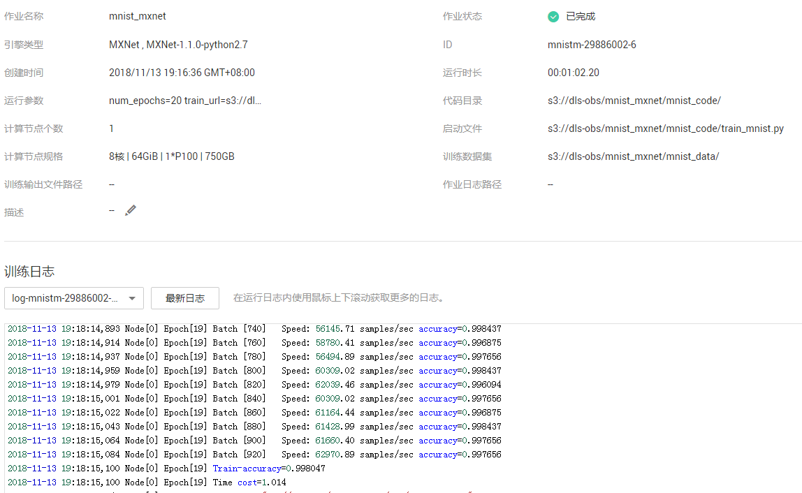
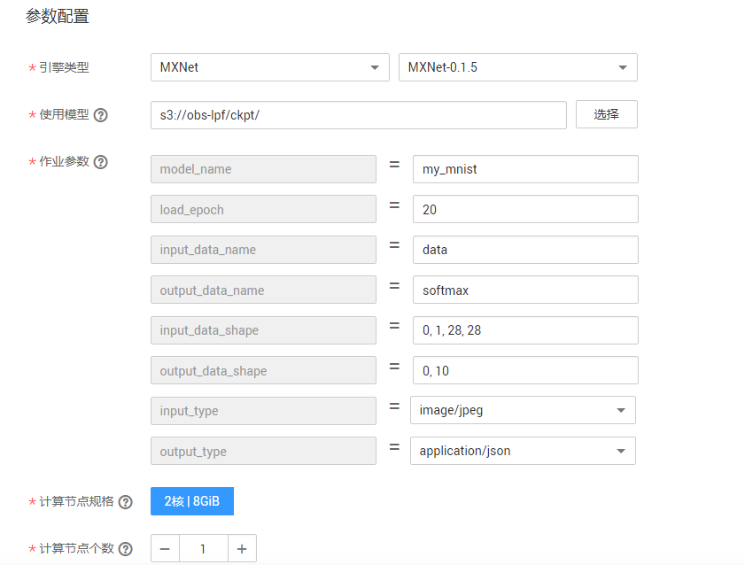
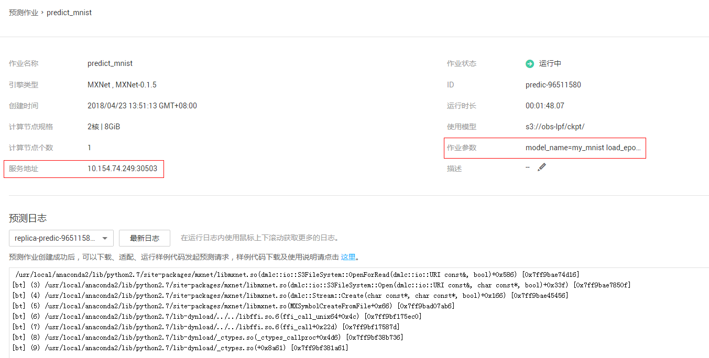

# 使用MXNet实现手写数字图像识别应用

本文介绍在华为云深度学习服务平台如何使用MXNet实现MNIST数据集的手写数字图像识别应用。操作的流程分为4部分，分别是：

- **准备数据**：下载文本数据集，解压后上传至OBS桶中。
- **训练模型**：使用MXNet原生接口编写模型训练脚本，新建训练作业进行模型训练。
- **部署模型**：得到训练好的模型文件后，新建预测作业将模型部署为在线预测服务。
- **发起预测请求**：下载并导入客户端工程，发起预测请求获取预测结果。


### 1. 准备数据
下载MNIST数据集，解压缩之后上传至OBS桶中。具体操作如下：

**步骤 1**  &#160; &#160; 下载MNIST数据集，数据集文件说明如下：
	
- t10k-images-idx3-ubyte.gz：验证集，共包含10000个样本。<a href = "https://dls-obs.obs.cn-north-1.myhwclouds.com/mnist_example/mnist_data/t10k-images-idx3-ubyte.gz">下载数据</a>
- t10k-labels-idx1-ubyte.gz：验证集标签，共包含10000个样本的类别标签。<a href = "https://dls-obs.obs.cn-north-1.myhwclouds.com/mnist_example/mnist_data/t10k-labels-idx1-ubyte.gz">下载数据</a>
- train-images-idx3-ubyte.gz：训练集，共包含60000个样本。<a href = "https://dls-obs.obs.cn-north-1.myhwclouds.com/mnist_example/mnist_data/train-images-idx3-ubyte.gz">下载数据</a>
- train-labels-idx1-ubyte.gz：训练集标签，共包含60000个样本的类别标签。<a href = "https://dls-obs.obs.cn-north-1.myhwclouds.com/mnist_example/mnist_data/train-labels-idx1-ubyte.gz">下载数据</a>


**步骤 2**  &#160; &#160; 解压缩4个压缩文件，并参考<a href = "https://support.huaweicloud.com/usermanual-dls/dls_01_0040.html">“上传业务数据”</a>章节内容，分别上传至华为云OBS桶 （假设OBS桶路径为：s3://dls-obs/mnist_mxnet/mnist_data/）。
### 2. 训练模型
接下来，要编写模型训练脚本代码（本案例中已编写好了训练脚本），并完成模型训练，操作步骤如下：

**步骤 1**  &#160; &#160; 下载由MXNet原生接口编写的模型训练脚本文件<a href ="codes/train_mnist.py">train\_mnist.py</a>。

**步骤 2**  &#160; &#160; 参考<a href = "https://support.huaweicloud.com/usermanual-dls/dls_01_0040.html">“上传业务数据”</a>章节内容，将脚本文件上传至华为云OBS桶 （假设OBS桶路径为：s3://dls-obs/mnist_mxnet/mnist_code/，其中mnist_code文件夹需要用户自己创建）。

**步骤 3**  &#160; &#160; 参考<a href ="https://support.huaweicloud.com/usermanual-dls/dls_01_0006.html">“访问深度学习服务”</a>章节内容，登录“深度学习服务”管理控制台。

**步骤 4**  &#160; &#160; 在“训练作业管理”界面，单击左上角的“创建训练作业”，参考图1填写训练作业参数。(train_url值为：s3://dls-obs/mnist_mxnet/log/，其中log文件夹需要用户自己创建)

图1 训练作业参数配置
 


**步骤 5**  &#160; &#160;  参数确认无误后，单击“提交作业”，完成训练作业创建。

**步骤 6**  &#160; &#160;  训练作业完成后，即完成了模型训练过程。如有问题，可点击作业名称，进入作业详情界面查看训练作业日志信息。训练结果如图2

图2 训练结果



**<font color=red>注意：</font>**

**<font color=red>训练时间超过一定时间，请及时手动停止，释放资源。否则会导致欠费，尤其对于使用GPU训练的模型项目。</font>**

**<font color=red>训练作业已完成，删除训练作业，以免一直占用资源。</font>**

### 3. 部署模型

模型训练完成后，可以创建预测作业，将模型部署为在线预测服务，操作步骤如下：

**步骤 1**  &#160; &#160; 在“预测作业管理”界面，单击左上角的“创建预测作业”，参考图2填写参数。其中，模型名称参数model_name，此处可随意指定。

图2 预测作业参数配置
 


**步骤 2**  &#160; &#160; 参数确认无误后，单击“提交作业”，完成预测作业创建。


当预测作业状态为“运行中”时，表示创建成功。单击预测作业名称，可看到如下界面信息如图3所示。在发起预测请求时，你需要查看IP地址、端口号和模型名称3个参数值。

图3 预测作业详情页面




### 4. 发起预测请求
完成模型部署后，将进行预测服务的请求访问，操作步骤如下：

**步骤 1**  &#160; &#160; 执行下面命令，下载客户端代码。

    git clone https://github.com/huawei-clouds/dls-mxserving-client.git

**步骤 2**  &#160; &#160; 执行如下命令，发起预测请求。
```
python dls-mxserving-client/python/image_classification_predict.py    
--server_url="http://10.154.74.249:30503/my_mnist/predict"   
--file_path="../../mnist_pic/6.jpg"
```
**注意：**

**这里参数server_url包含了服务的IP和端口号，file\_path表示待预测图片的路径。**

**关于发起预测请求的详细操作指导，请参考：https://github.com/huawei-clouds/dls-mxserving-client 。**
