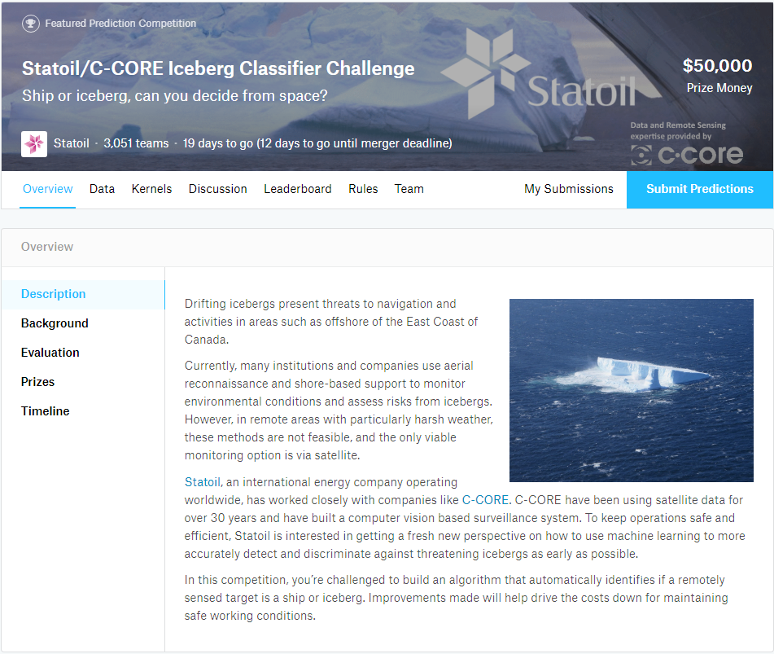
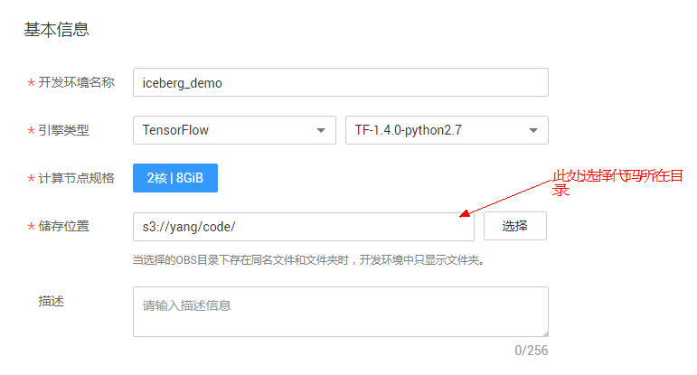
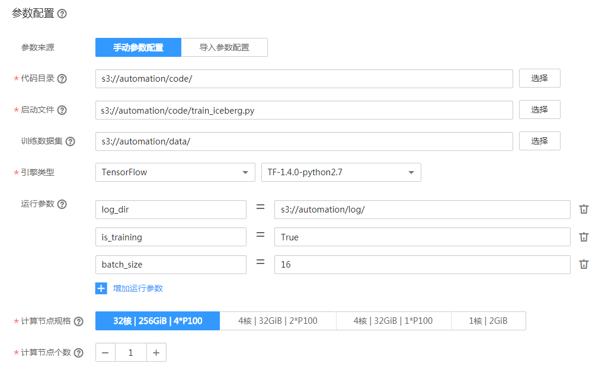
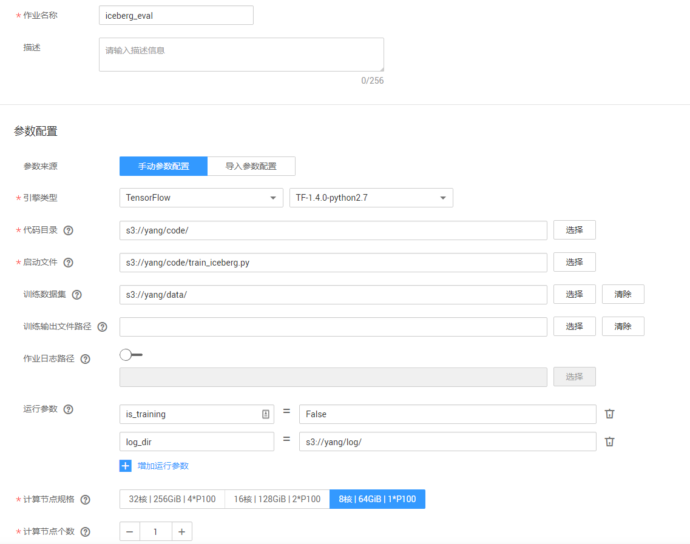
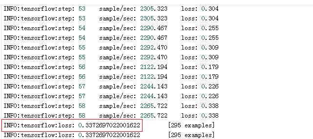

# 使用MoXing实现冰山图像分类应用

本文介绍如何在华为云深度学习服务平台上使用MoXing实现Kaggle竞赛中的冰山图像分类任务。实验所使用的图像为雷达图像，需要参赛者利用算法识别出图像中是冰山（iceberg）还是船（ship）。操作的流程分为4部分，分别是：

1.	**准备数据**：下载数据集并上传至华为云OBS桶中，编写代码将数据集格式转换成TFRecord。
3.	**训练模型**：使用MoXing API编写用实现冰山图像分类的网络模型，新建训练作业进行模型训练。
4.	**预测结果**：再次新建训练作业，对test数据集进行预测，并将结果保存到csv文件。
5.	**查看结果**：将预测结果的csv文件提交到Kaggle官网后获取分类结果。
### 1. 准备数据
首先登陆Kaggle官网，下载冰山图像分类数据集并上传至华为云OBS桶中。然后通过华为云深度学习服务在线IDE将数据集格式转换成TFRecord格式，操作步骤如下：

**步骤 1**  &#160; &#160; 登录<a href="https://www.kaggle.com/competitions">Kaggle官网</a>，注册并登录账号。

**步骤 2**  &#160; &#160; 选择<a href = "https://www.kaggle.com/c/statoil-iceberg-classifier-challenge">“Statoil/C-CORE Iceberg Classifier Challenge”</a>，进入冰山识别任务简介页面，如图1所示。

图1 冰山识别任务简介页面

**步骤 3**  &#160; &#160; 单击“Data”页签，在文件列表中，单击“Download”，下载数据文件，如图2所示。其中，数据文件包括：

- sample_submission.csv： 提交答案的模板。
- test.json.7z：预测数据集，需要根据该数据集预测出答案，没有分类标签。
- train.json.7z：训练数据集，有分类标签。

图2 数据下载界面

 

**步骤 4**  &#160; &#160; 下载数据集后，解压训练集和预测集，得到train.json和test.json（该格式可以通过pandas.read_json进行读取）。

其中，训练集train.json包含4类数据：band\_1、band\_2、inc\_angle和is_iceberg（测试集），分别是：

- band\_1、band\_2：雷达图像的2个通道，分别是75x75的矩阵。
- inc_angle：雷达图拍摄角度，单位是角度。
- is_iceberg： 标注，冰山为1，船为0。

**步骤 5**  &#160; &#160; 参考<a href = "https://support.huaweicloud.com/usermanual-dls/dls_01_0040.html">“上传业务数据”</a>章节内容，将数据集上传至华为云OBS桶 （假设OBS桶路径为：s3://automation/data/）。

**步骤 6**  &#160; &#160; 参考<a href ="https://support.huaweicloud.com/usermanual-dls/dls_01_0006.html">“访问深度学习服务”</a>章节内容，登录“深度学习服务”管理控制台。

**步骤 7**  &#160; &#160; 在“开发环境管理”界面，单击“创建开发环境”，在弹出框中填写对应参数，如图3。单击“确定”，完成创建操作。

图3 创建开发环境对话框

 

**步骤 8**  &#160; &#160; 在开发环境列表中，单击所创建开发环境右侧的“打开”，输入密码后，进入Jupyter Notebook文件目录界面。

**步骤 9**  &#160; &#160; 单击右上角的“New”，选择“Python 2” ，进入代码开发界面。在Cell中填写数据转换代码，完整代码请参见<a href ="codes/data_format_conversion.py">data\_format_conversion.py</a>（请根据数据集实际存储位置，修改脚本代码）。

**步骤 10**  &#160; &#160; 单击Cell上方的 ，运行代码。代码运行成功后，将在“s3://automation/data/”目录下生成如下三个文件：

- iceberg-train-1176.tfrecord：训练数据集
- iceberg-eval-295.tfrecord：验证数据集
- iceberg-test-8424.tfrecord：预测数据集

### 2. 训练模型
将模型训练脚本上传至OBS桶中（您也可以在DLS的开发环境中编写模型训练脚本，并转成py文件），然后创建训练作业进行模型训练，操作步骤如下：

**步骤 1**  &#160; &#160; 参考<a href = "https://support.huaweicloud.com/usermanual-dls/dls_01_0040.html">“上传业务数据”</a>章节内容，将模型训练脚本文件<a href ="codes/train_iceberg.py">train\_iceberg.py</a>上传至华为云OBS桶 （假设OBS桶路径为：s3://yang/code/）。

**步骤 2**  &#160; &#160; 返回“深度学习服务管理”控制台，在“训练作业管理”界面。 单击左上角的“创建训练作业”，参考图4填写参数。

图4 训练作业参数

**步骤 3**  &#160; &#160; 单击“提交作业”，完成训练作业创建。

### 3. 预测结果
待训练作业运行完成后，在“s3://yang/log”目录下生成模型文件（如：model.ckpt-5600）。由于我们只需要进行一次预测，因此不需要部署在线预测服务。相关的预测操作已经在“train_iceberg.py”文件写好，预测结果将输出到“submission.csv”文件。我们使用训练作业进行预测，操作步骤如下：

**步骤 1**  &#160; &#160; 在“训练作业管理”界面，单击左上角的“创建训练作业”，参考图5填写参数。

图5 训练作业参数配置
 

**步骤 2**  &#160; &#160; 单击“提交作业”，完成训练作业创建。

**步骤 3**  &#160; &#160; 训练作业执行完成后，在“训练作业管理”界面，单击iceberg_eval作业名称，进入作业的详情界面。在“训练日志”中，可以查看到在eval数据集上的loss值为0.295，如图6。在“yang/log”目录下，能看到用于保存预测结果的“submission.csv”文件。

图6 训练作业日志

 
### 4. 提交预测结果
登录Kaggle官网，将“submission.csv”文件提交到Kaggle上，得到预测结果的准确率（错误率），如图7。

图7 提交结果界面
 

