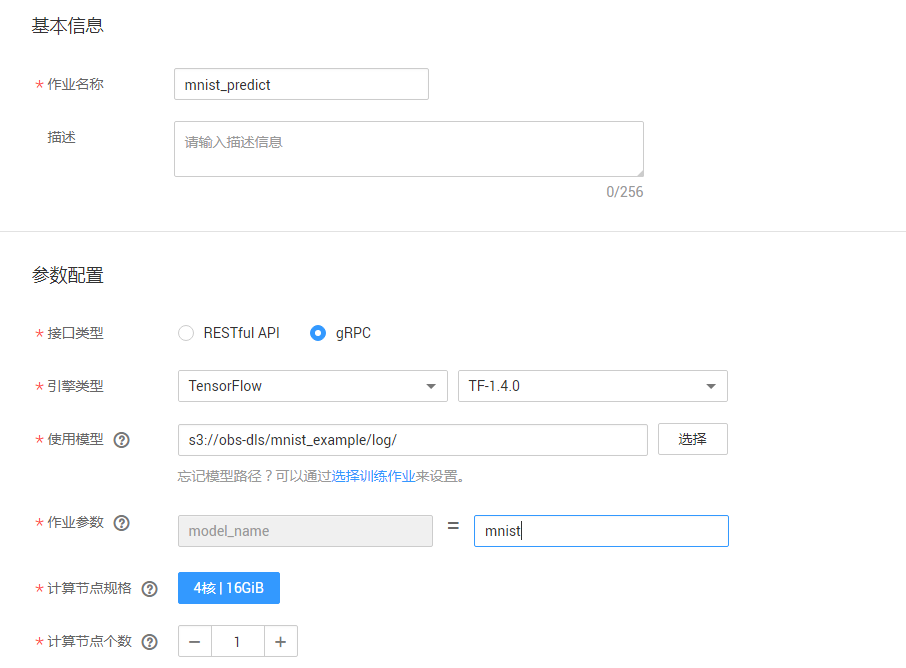
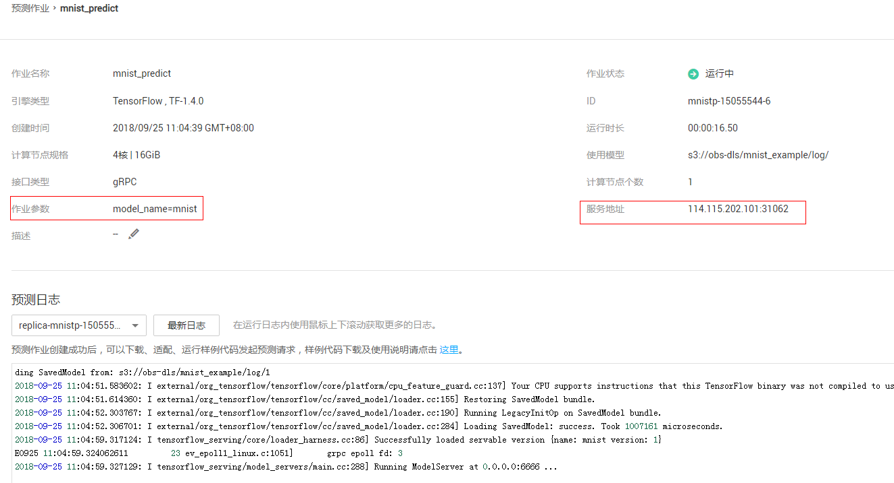

# 使用MoXing实现手写数字图像识别应用

本文介绍在华为云深度学习服务平台如何使用MoXing实现MNIST数据集的手写数字图像识别应用。操作的流程分为4部分，分别是：

基本流程包含以下步骤：

1. **准备数据**：下载文本数据集，上传至OBS桶中。
2. **训练模型**：使用MoXing框架编模型训练脚本，新建训练作业进行模型训练。
3. **部署模型**：得到训练好的模型文件后，新建预测作业将模型部署为在线预测服务。
4. **发起预测请求**：下载并导入客户端工程，发起预测请求获取预测结果。

### 1. 准备数据
下载MNIST数据集，解压缩之后上传至OBS桶中。具体操作如下：

**步骤 1**  &#160; &#160; 下载MNIST数据集。下载路径为：http://data.mxnet.io/data/mnist/ 。 数据集文件说明如下：
- t10k-images-idx3-ubyte.gz：验证集，共包含10000个样本。
- t10k-labels-idx1-ubyte.gz：验证集标签，共包含10000个样本的类别标签。
- train-images-idx3-ubyte.gz：训练集，共包含60000个样本。
- train-labels-idx1-ubyte.gz：训练集标签，共包含60000个样本的类别标签。

**步骤 2**  &#160; &#160; 参考<a href = "https://support.huaweicloud.com/usermanual-dls/dls_01_0040.html">“上传业务数据”</a>章节内容，分别上传至华为云OBS桶 （假设OBS桶路径为：s3://obs-lpf/data/mnist/）。

### 2. 训练模型
接下来，要编写模型训练脚本代码（本案例中已编写好了训练脚本），并完成模型训练，操作步骤如下：

**步骤 1**  &#160; &#160; 下载模型训练脚本文件<a href ="codes/train_mnist.py">train\_mnist.py</a>。参考<a href = "https://support.huaweicloud.com/usermanual-dls/dls_01_0040.html">“上传业务数据”</a>章节内容，将脚本文件上传至华为云OBS桶 （假设OBS桶路径为：s3://obs-lpf/test/mnist/）。

**步骤 2**  &#160; &#160; 参考<a href ="https://support.huaweicloud.com/usermanual-dls/dls_01_0006.html">“访问深度学习服务”</a>章节内容，登录“深度学习服务”管理控制台。

**步骤 3**  &#160; &#160; 在“训练作业管理”界面，单击左上角的“创建训练作业”，参考图1填写训练作业参数。

图1 训练作业参数配置（训练）
 

**步骤 4**  &#160; &#160;  参数确认无误后，单击“提交作业”，完成预测作业创建。

**步骤 5**  &#160; &#160; 在模型训练的过程中或者完成后，通过创建TensorBoard作业查看一些参数的统计信息，如loss， accuracy等。图2为TensorBoard作业的参数配置。其中，TensorBoard日志路径为训练作业中train_url设置的路径。图3为TensorBoard可视化界面。

图2 TensorBoard作业参数配置

图3 TensorBoard可视化界面

训练作业完成后，即完成了模型训练过程。如有问题，可点击作业名称，进入作业详情界面查看训练作业日志信息。

### 3. 部署模型

模型训练完成后，可以创建预测作业，将模型部署为在线预测服务，操作步骤如下：

**步骤 1**  &#160; &#160; 在“预测作业管理”界面，单击左上角的“创建预测作业”，参考图4填写参数。其中，模型名称参数model_name，此处可随意指定。

图4 预测作业参数配置
 

**步骤 2**  &#160; &#160; 参数确认无误后，单击“提交作业”，完成预测作业创建。

当预测作业状态为“运行中”时，表示创建成功。单击预测作业名称，可看到如下界面信息如图5所示。在发起预测请求时，你需要查看IP地址、端口号和模型名称3个参数值。

图5 预测作业详情页面

### 4. 发起预测请求
说明：请保证客户端能够连接互联网。
如果是windows用户，请先安装git bash，并配置好python, pip环境（推荐使用Anaconda）。linux用户在terminal中按照以下步骤运行（以下步骤仅针对python客户端，JAVA客户端请参考文档底部链接获取详细指导）。
完成模型部署后，将进行预测服务的请求访问，操作步骤如下：
步骤 1     执行下面命令，下载客户端代码。
git clone https://github.com/huawei-clouds/dls-tfserving-client.git
步骤 2     安装依赖及配置python环境变量。
     1.安装 tensorflow
        pip install tensorflow
     2.安装其它依赖包
        pip install image
     3.把下列路径加入到环境变量 PYTHONPATH 中
        export PYTHONPATH=PYTHONPATH:<i>xx</i>/dls-tfserving-client/python/predict_client
注意: xx是指"dls-tfserving-client" 所在的目录。
步骤3  在xx/dls-tfserving-client/python/下新建python代码文件，命名为：predict_mnist.py，具体代码请访问https://github.com/huaweicloud/dls-example/blob/master/Using%20MoXing%20to%20Create%20a%20MNIST%20Dataset%20Recognition%20Application/codes/predict_mnist.py
步骤4  根据实际情况修改predict_mnist.py文件中的部分代码，如下所示。
IMAGE_PATH = '/export1/zzy/mnist/3.png'    #根据实际待预测图片的保存地址修改参数
HOST = '10.155.167.202'  #根据实际服务IP地址修改
PORT = 31670             #根据实际服务端口号修改
MODEL_NAME = 'mnist'     #根据实际服务运行参数model_name修改
SIGNATURE_NAME = 'predict_object'
MAX_RESPONSE_TIME = 3000
步骤5 运行代码
python predict_mnist.py
**注意：**

**这里参数server\_url包含了服务的IP和端口号，file_path表示待预测图片的路径。**

**关于发起预测请求的详细操作指导，请参考：https://github.com/huawei-clouds/dls-tfserving-client 。**
