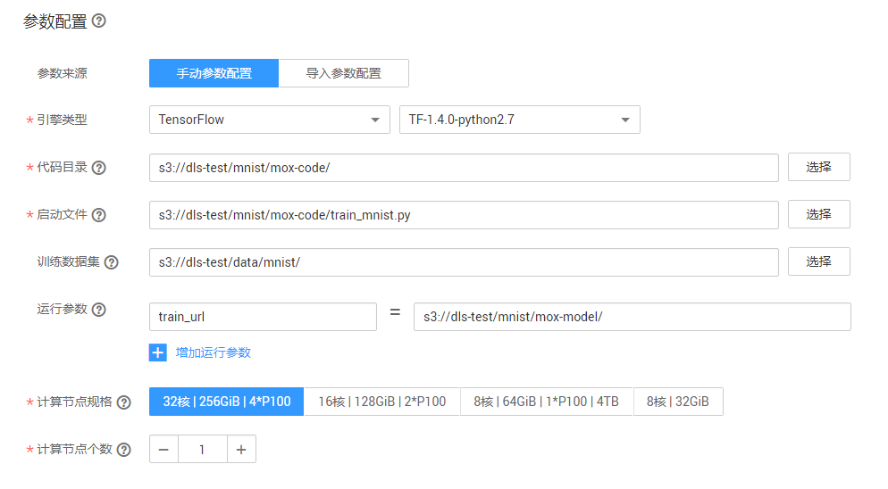
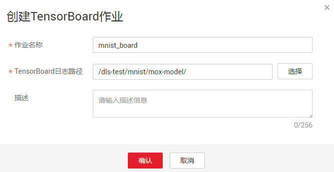
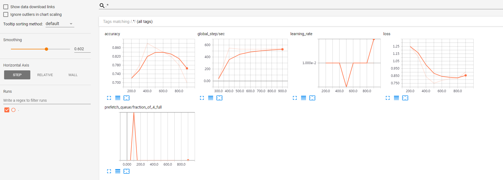
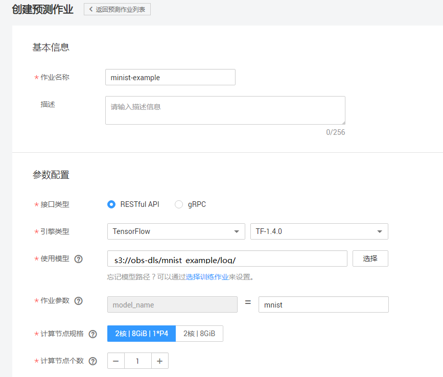
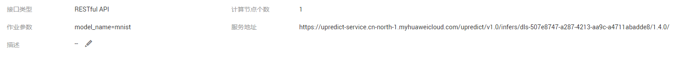
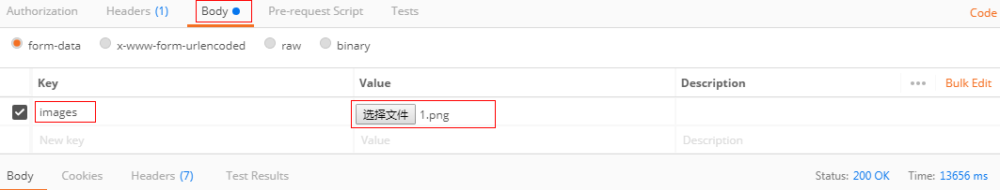

# 使用MoXing实现手写数字图像识别应用

本文介绍在华为云深度学习服务平台如何使用MoXing实现MNIST数据集的手写数字图像识别应用。操作的流程分为4部分，分别是：

基本流程包含以下步骤：

1. **准备数据**：下载文本数据集，上传至OBS桶中。
2. **训练模型**：使用MoXing框架编模型训练脚本，新建训练作业进行模型训练。
3. **部署模型**：得到训练好的模型文件后，新建预测作业将模型部署为在线预测服务。
4. **发起预测请求**：下载并导入客户端工程，发起预测请求获取预测结果。

### 1. 准备数据
下载MNIST数据集，解压缩之后上传至OBS桶中。具体操作如下：

**步骤 1**  &#160; &#160; 下载MNIST数据集， 数据集文件说明如下：
- t10k-images-idx3-ubyte.gz：验证集，共包含10000个样本。<a href = "https://dls-obs.obs.cn-north-1.myhwclouds.com/mnist_example/mnist_data/t10k-images-idx3-ubyte.gz">下载数据</a>
- t10k-labels-idx1-ubyte.gz：验证集标签，共包含10000个样本的类别标签。<a href = "https://dls-obs.obs.cn-north-1.myhwclouds.com/mnist_example/mnist_data/t10k-labels-idx1-ubyte.gz">下载数据</a>
- train-images-idx3-ubyte.gz：训练集，共包含60000个样本。<a href = "https://dls-obs.obs.cn-north-1.myhwclouds.com/mnist_example/mnist_data/train-images-idx3-ubyte.gz">下载数据</a>
- train-labels-idx1-ubyte.gz：训练集标签，共包含60000个样本的类别标签。<a href = "https://dls-obs.obs.cn-north-1.myhwclouds.com/mnist_example/mnist_data/train-labels-idx1-ubyte.gz">下载数据</a>

**步骤 2**  &#160; &#160; .gz数据无需解压，参考<a href = "https://support.huaweicloud.com/usermanual-dls/dls_01_0040.html">“上传业务数据”</a>章节内容，分别上传至华为云OBS桶 （假设OBS桶路径为：s3://obs-dls/mnist_example/mnist_data/）。

### 2. 训练模型
接下来，要编写模型训练脚本代码（本案例中已编写好了训练脚本），并完成模型训练，操作步骤如下：

**步骤 1**  &#160; &#160; 下载模型训练脚本文件<a href ="codes/train_mnist.py">train\_mnist.py</a>。参考<a href = "https://support.huaweicloud.com/usermanual-dls/dls_01_0040.html">“上传业务数据”</a>章节内容，将脚本文件上传至华为云OBS桶 （假设OBS桶路径为：s3://obs-dls/mnist_example/mnist_code/）。

**步骤 2**  &#160; &#160; 参考<a href ="https://support.huaweicloud.com/usermanual-dls/dls_01_0006.html">“访问深度学习服务”</a>章节内容，登录“深度学习服务”管理控制台。

**步骤 3**  &#160; &#160; 在“训练作业管理”界面，单击左上角的“创建训练作业”，参考图1填写训练作业参数。

图1 训练作业参数配置（训练）
 

**步骤 4**  &#160; &#160;  参数确认无误后，单击“提交作业”，完成预测作业创建。

**步骤 5**  &#160; &#160; 在模型训练的过程中或者完成后，通过创建TensorBoard作业查看一些参数的统计信息，如loss， accuracy等。图2为TensorBoard作业的参数配置。其中，TensorBoard日志路径为训练作业中train_url设置的路径。图3为TensorBoard可视化界面。

图2 TensorBoard作业参数配置

图3 TensorBoard可视化界面

训练作业完成后，即完成了模型训练过程。如有问题，可点击作业名称，进入作业详情界面查看训练作业日志信息。（计算节点个数：1,计算节点规格：8核|64GiB|1*P100|750GB，运行时长：00:00:41.20）

**注意：**

**训练时间超过一定时间，请及时手动停止，释放资源。否则会导致欠费，尤其对于使用GPU训练的模型项目。**

**训练作业已完成，删除训练作业，以免一直占用资源。**

### 3. 部署模型

模型训练完成后，可以创建预测作业，将模型部署为在线预测服务，操作步骤如下：

**步骤 1**  &#160; &#160; 在“预测作业管理”界面，单击左上角的“创建预测作业”，参考图4填写参数。其中，模型名称参数model_name，此处可随意指定。

图4 预测作业参数配置
 

**步骤 2**  &#160; &#160; 参数确认无误后，单击“提交作业”，完成预测作业创建。

当预测作业状态为“运行中”时，表示创建成功。单击预测作业名称，可看到界面信息，其中服务地址用于发起预测请求。

图5 服务地址获取

### 4. 发起预测请求

完成模型部署后，将进行预测服务的请求访问，操作步骤如下：
**步骤 1** 下载Postman软件并安装，或直接在chrome浏览器添加postman扩展程序（也可使用其它支持发送post请求的软件）。

**步骤 2** 打开Postman，获取Token(关于如何获取token，请参考<a href ="https://support.huaweicloud.com/api-dls/dls_03_0005.html">“获取请求认证”</a>）。

图6 token获取

**步骤 3** 在Postman界面填写参数
1）选择POST任务，将预测作业的服务地址（以“https://”开头的URL地址）复制到 POST后面的方框。Headers栏的Key值填写为“X-Auth-Token”，Value值为您获取到的Token。

图7 参数填写

2）在Body栏下，选择“form-data”。在Key值填输出模型时的“inputs key”，比如本例中保存模型时每个图片对应的inputs key值为“images”。然后在value值，选择文件，上传一张待预测图片（当前仅支持单张图片预测）。

图8 image上传

3）参数填写完成，点击“send”发送请求，结果会在Response下的对话框里显示。

**注意：**

**预测请求结束后，后续不使用预测服务的情况下，删除预测作业，以免一直占用资源。**
