# 使用预置模型实现花卉图像分类应用

本文介绍在华为云深度学习服务平台如何使用flowers数据集对预置的ResNet_v1\_50模型进行重训练，快速构建花卉图像分类应用。操作步骤分为4部分，分别是：

1.	**准备数据**：下载flowers数据集，并上传至华为云对象存储服务器（OBS）中，并将数据集划分为训练集和验证集。
2.	**训练模型**：使用flowers训练集，对ResNet_v1\_50模型重训练，得到新模型。
3.	**部署模型**：将得到的模型，部署为在线预测服务。
4.	**发起预测请求**：下载客户端工程，发起预测请求获取请求结果。
### 1. 准备数据
下载flowers数据集并上传至华为云对象存储服务器（OBS）桶中，操作步骤如下：

**步骤 1** &#160; &#160; 下载并解压缩数据集压缩包<a href = "https://dls-obs.obs.cn-north-1.myhwclouds.com/flower_class/data/flower_photos.tgz">flower_photos.tgz</a>。

**步骤 2**&#160; &#160; 参考<a href="https://support.huaweicloud.com/usermanual-dls/dls_01_0040.html">“上传业务数据”</a>章节内容，将数据集上传至华为云OBS桶中（假设OBS桶路径为：“s3://obs-dls-flowers-demo/data/flowers_photos”）。

该路径下包含了用户训练模型需要使用的所有图像文件， 该目录下有5个子目录，代表5种类别，分别为：daisy, dandelion, roses, sunflowers, tulips。每个子目录的文件夹名称即代表该分类的label信息，每个子目录下存放对应该目录的所有图像文件，则目录结构为：

    s3://obs-dls-flowers-demo/data/flowers_photos
	    |- daisy
	       |- 01.jpg
	       |- ...
	    |- dandelion
	       |- 11.jpg
	       |- ...
	    |- roses
	       |- 21.jpg
	       |- ...
	    |- sunflowers
	       |- 31.jpg
	       |- ...
	    |- tuplis
	       |- 41.jpg
	       |- ...

**步骤 3**  &#160; &#160; 参考“[访问深度学习服务](https://support.huaweicloud.com/usermanual-dls/dls_01_0006.html)”章节内容，登录“[深度学习服务](https://support.huaweicloud.com/usermanual-dls/dls_01_0006.html)”管理控制台。

**步骤 4**&#160; &#160; 单击左侧导航栏的“开发环境管理”，在“开发环境管理”界面，单击“创建开发环境”，在弹出框中，输入开发环境名称、引擎类型（请选择TF-1.8.0-python27或者TF-1.8.0-python36）、计算节点规格、存储位置等参数，单击“立即创建”，完成创建操作。

图1 开发环境的创建

图2 开发环境的参数配置

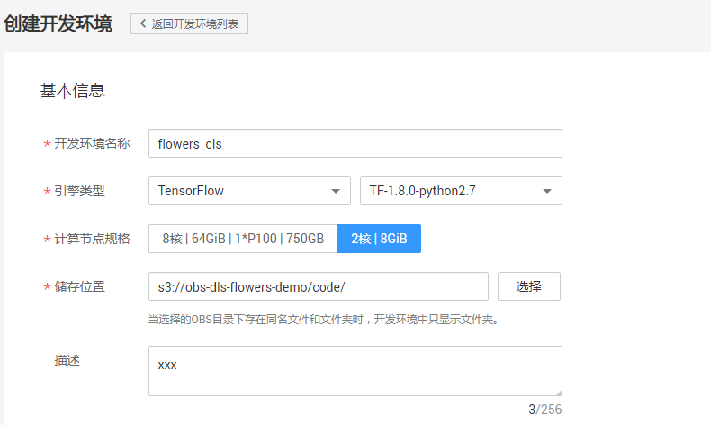

**步骤 5**&#160; &#160; 在开发环境列表中，单击所创建开发环境右侧的“打开”，进入Jupyter Notebook文件目录界面。

**步骤 6**&#160; &#160; 单击右上角的“New”，选择“Python 2” ，进入代码开发界面。参见数据格式转换完整代码，在Cell中填写数据代码。

    
    from moxing.tensorflow.datasets.raw.raw_dataset import split_image_classification_dataset
	    
    split_image_classification_dataset(
          split_spec={'train': 0.9, 'eval': 0.1},
          src_dir='s3://obs-dls-flowers-demo/data/flowers_photos',
          dst_dir='s3://obs-dls-flowers-demo/data/flowers_raw',
          overwrite=False)

图3 Jupyter 创建cell界面

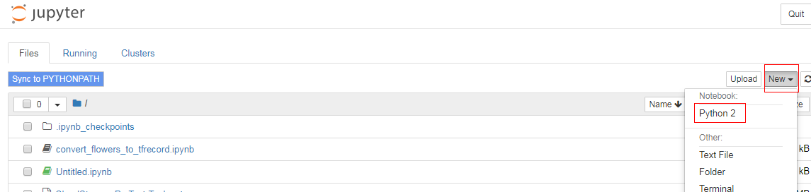

**步骤 7**&#160; &#160; 单击Cell上方的运行按钮 ，运行代码。将数据集按9：1的比例划分为train和eval两部分，并输出到“s3://obs-dls-flowers-demo/data/flowers_raw”，目录结果如下所示：

    s3://obs-dls-flowers-demo/data/flowers_raw
	    |- train
		    |- daisy
		       |- 01.jpg
		       |- ...
		    |- dandelion
		       |- 11.jpg
		       |- ...
		    |- roses
		       |- 21.jpg
		       |- ...
		    |- sunflowers
		       |- 31.jpg
		       |- ...
		    |- tuplis
		       |- 41.jpg
		       |- ...
	    |- eval
		    |- daisy
		       |- 02.jpg
		       |- ...
		    |- dandelion
		       |- 12.jpg
		       |- ...
		    |- roses
		       |- 22.jpg
		       |- ...
		    |- sunflowers
		       |- 32.jpg
		       |- ...
		    |- tuplis
		       |- 42.jpg
		       |- ...

### 2. 训练模型
接下来将使用训练集对预置的ResNet_v1\_50模型进行重训练获取新的模型，操作步骤如下：

**步骤 1**&#160; &#160; 返回“深度学习服务”管理控制台界面。单击左侧导航栏的“预置模型库”，进入“预置模型库”界面。

**步骤 2**&#160; &#160;在列表中找到名称为“ResNet\_v1\_50”的模型，单击“拷贝至OBS”，弹出“拷贝至OBS”对话框，如图所示。先对要使用的桶进行授权，然后，选择某个路径用于存放模型。单击“确认”，完成拷贝操作。

图4 模型导入至OBS桶

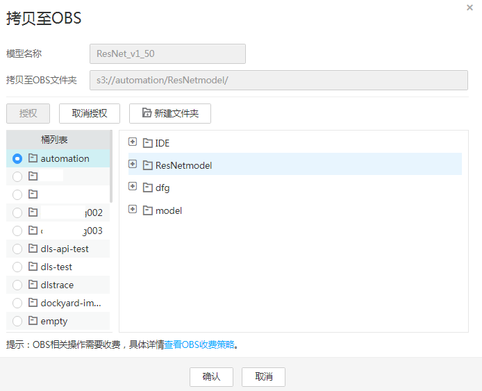

**步骤 3**&#160; &#160; 在“预置模型库”界面，单击“ResNet\_v1\_50”所在行右侧的“创建训练作业”，进入“创建训练作业”界面。

**步骤 4**&#160; &#160; 参考下图完成作业参数配置。其中，“代码目录”和“启动文件”无需用户填写，"训练数据集"请选择训练集和验证集所在的父目录（在本案例中，即s3://obs-dls-flowers-demo/data/flowers_raw/），“train_url”为模型保存路径。

图5 训练作业的参数配置图

**步骤 5**&#160; &#160; 检查当前配置，确认无误后，单击“提交作业”，完成训练作业创建。训练作业运行成功时如下图所示。

图6 训练作业运行成功

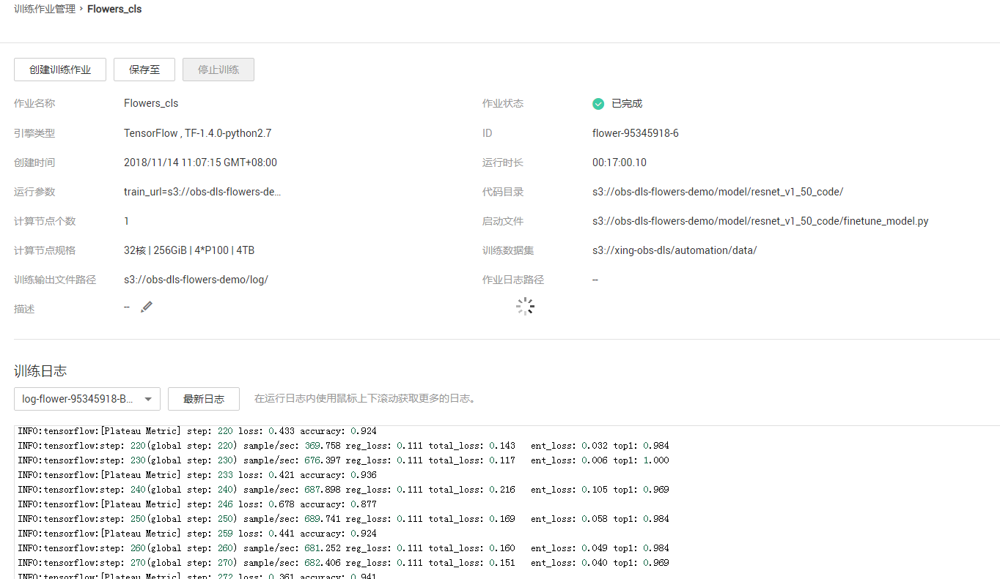

**步骤 6**&#160; &#160; 训练作业的运行过程中或者运行结束后进入“可视化管理”界面点击“创建TensorBoard作业”即可查看模型训练的结果，        当训练作业运行成功后，可在模型保存路径下查看新的模型文件。

图7 创建TensorBoard作业

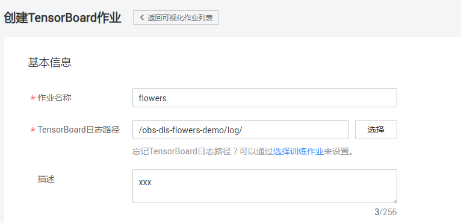

图8 TensorBoard界面

**注意：**

**训练时间超过一定时间，请及时手动停止，释放资源。否则会导致欠费，尤其对于使用GPU训练的模型项目。**

**训练作业已完成，删除训练作业，以免一直占用资源。**

### 3. 部署模型

模型训练完成后，可以创建预测作业，将模型部署为在线预测服务，操作步骤如下：

**步骤 1**  &#160; &#160; 在“预测作业管理”界面，单击“创建预测作业”，进入“创建预测作业”界面。

**步骤 2**  &#160; &#160; 参考下图完成参数配置。其中，“使用模型”为模型存放路径，请参考训练作业中运行参数“train_url”的值。

图9 预测作业参数配置

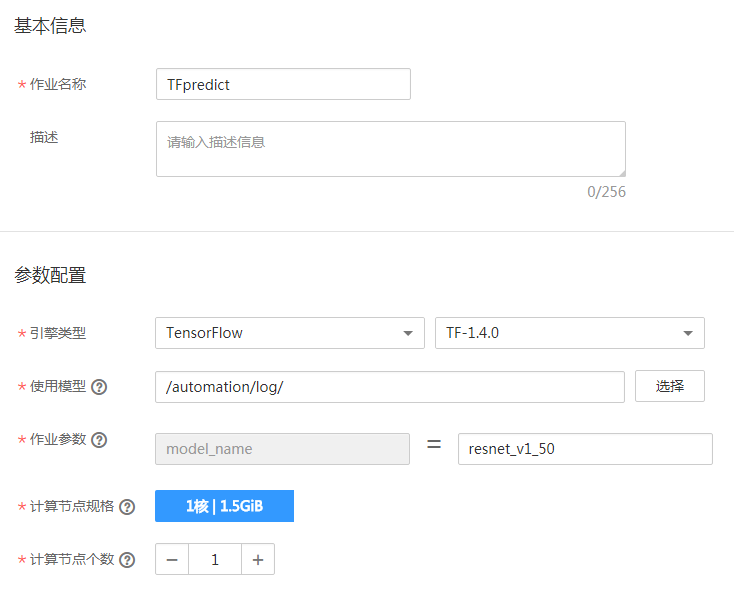

**步骤 3**  &#160; &#160; 检查当前配置，确认无误后，单击“提交作业”，完成预测作业的创建。此时，可以在“预测作业管理”界面的作业列表中查看已创建的预测作业。

### 4. 发起预测请求

当预测作业的状态处于“运行中”，表示预测服务已部署，如下图所示。

图10 部署预测服务

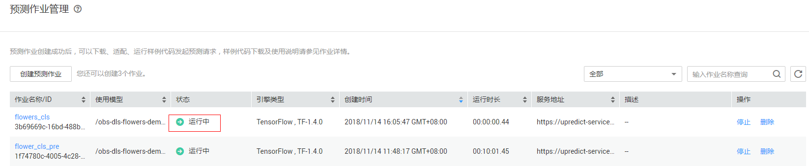

**步骤 1**  &#160; &#160; 下载Postman软件并安装，或直接在chrome浏览器添加postman扩展程序（也可使用其它支持发送post请求的软件）。

**步骤 2**  &#160; &#160; 打开Postman，获取Token(关于如何获取token，请参考[获取请求认证](https://support.huaweicloud.com/api-dls/dls_03_0005.html)）。如下图所示。

图11 获取Token

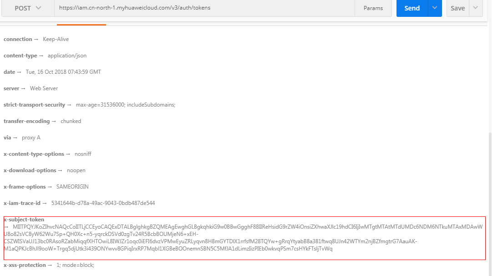

**步骤 3**  &#160; &#160; 选择POST任务，将预测作业的服务地址（以“https://”开头的URL地址）复制到 POST后面的方框。Headers栏的Key值填写为“X-Auth-Token”，Value值为您获取到的Token，如下图所示。

图12 post参数填写

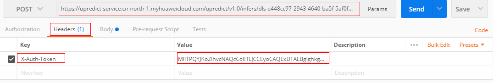

**步骤 3**  &#160; &#160; 在Body栏下，选择“form-data”。在Key值填输出模型时的“inputs key”，比如本例中保存模型时每个图片对应的inputs key值为“**images**”。然后在value值，选择文件，上传一张待预测图片（当前仅支持单张图片预测），参数填写完成，点击“send”发送请求，结果会在Response下的对话框里显示,如下图。

图13 预测结果显示

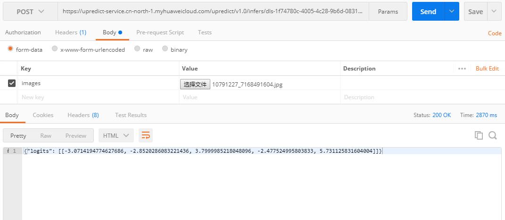

注： "logtis"值为长度为5的list列表，分别与flowers的五个类别对应，值越大说明此类别的得分越高，属于此类的可能性越大。位置与类别的对应关系可在训练作业的打印日志中看到，如下图。

图14 类别列表

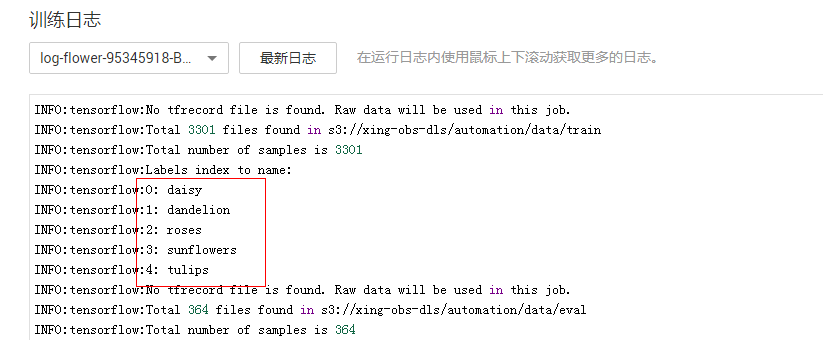

**注意：**

**预测请求结束后，后续不使用预测服务的情况下，删除预测作业，以免一直占用资源。**
