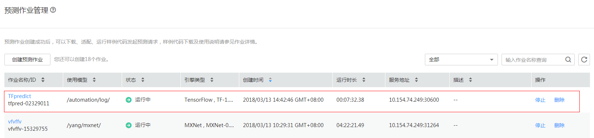

# 使用预置模型实现花卉图像分类的应用

本文介绍如何使用flowers数据集对预置的ResNet_v1\_50模型进行重训练，快速构建花卉图像分类应用。操作步骤分为5部分，分别是：

1.	准备数据：下载flowers数据集，并上传至华为云对象存储服务器（OBS）中。
2.	划分数据集：通过编写代码将数据集划分为训练集和验证集。
3.	训练模型：使用flowers训练集，对ResNet_v1\_50模型重训练，得到新模型。
4.	部署模型：将得到的模型，部署为在线预测服务。
5.	访问服务：使用预置的客户端工程，发起对预测服务的访问请求，获取请求结果。
### 1. 准备数据
下载flowers数据集并上传至华为云对象存储服务器（OBS）桶中，操作步骤如下：

**步骤 1**  下载并解压缩数据集压缩包“flower_photos.tgz”，flowers数据集的下载路径为：http://download.tensorflow.org/example_images/flower_photos.tgz。

**步骤 2**	参考<a href = "https://support.huaweicloud.com/usermanual-dls/dls_01_0040.html">“上传业务数据”</a>章节内容，将数据集上传至华为云OBS桶中（假设OBS桶路径为：“s3://automation/data”）。 

该路径下包含了用户训练模型需要使用的所有图像文件， 该目录下有5个子目录，代表5种类别，分别为：daisy, dandelion, roses, sunflowers, tuplis。每个子目录的文件夹名称即代表该分类的label信息，每个子目录下存放对应该目录的所有图像文件，则目录结构为：

    s3://automation/data/flower_photos 
	    |- daisy 
	       |- 01.jpg 
	       |- 02.jpg 
	       |- ... 
	    |- dandelion 
	       |- 11.jpg 
	       |- 12.jpg 
	       |- ... 
	    |- roses 
	       |- 21.jpg 
	       |- 22.jpg 
	       |- ... 
	    |- sunflowers 
	       |- 31.jpg 
	       |- 32.jpg 
	       |- ... 
	    |- tuplis 
	       |- 41.jpg 
	       |- 42.jpg 
	       |- ...
### 2. 划分数据集
将上传的数据集划分为训练集和验证集，操作步骤如下：

**步骤 1**   参考<a href ="https://support.huaweicloud.com/usermanual-dls/dls_01_0006.html">“访问深度学习服务”</a>章节内容，登录“深度学习服务”管理控制台，单击左侧导航栏的“开发环境管理”。

**步骤 2**	在“开发环境管理”界面，单击“创建开发环境”，在弹出框中，输入开发环境名称、密码、确认密码、引擎类型、代码存储的OBS路径等参数，单击“确定”，完成创建操作。

**步骤 3**	在开发环境列表中，单击所创建开发环境右侧的“打开”，输入密码后，进入Jupyter Notebook文件目录界面。

**步骤 4**	单击右上角的“New”，选择“Python 2” ，进入代码开发界面。参见数据格式转换完整代码，在Cell中填写数据代码。

    from moxing.tensorflow.datasets.reader import raw_reader 

    raw_reader.split_image_classification_dataset(split_spec={'train': 0.9, 'eval': 0.1}, 
        src_dir='s3://automation/data/flower_photos', 
        dst_dir='s3://automation/data', 
        overwrite=False)

**步骤 5**	单击Cell上方的运行按钮 ，运行代码。将数据集按9：1的比例划分为train和eval两部分，并输出到“s3://automation/data”，目录结果如下所示：

    s3://automation/data 
	    |- train 
		    |- daisy 
		       |- 01.jpg 
		       |- ... 
		    |- dandelion 
		       |- 11.jpg 
		       |- ... 
		    |- roses 
		       |- 21.jpg 
		       |- ... 
		    |- sunflowers 
		       |- 31.jpg 
		       |- ... 
		    |- tuplis 
		       |- 41.jpg 
		       |- ... 
	    |- eval 
		    |- daisy 
		       |- 02.jpg 
		       |- ... 
		    |- dandelion 
		       |- 12.jpg 
		       |- ... 
		    |- roses 
		       |- 22.jpg 
		       |- ... 
		    |- sunflowers 
		       |- 32.jpg 
		       |- ... 
		    |- tuplis 
		       |- 42.jpg 
		       |- ...

### 3. 训练预置
接下来将使用训练集对预置的ResNet_v1\_50模型进行重训练获取新的模型，操作步骤如下：

**步骤 1**	返回“深度学习服务”管理控制台界面。单击左侧导航栏的“预置模型库”，进入“预置模型库”界面。

**步骤 2**	在列表中找到名称为“ResNet_v1\_50”的模型，单击“拷贝至OBS”，弹出“拷贝至OBS”对话框，如图1所示。先对要使用的桶进行授权，然后，选择某个路径用于存放模型。单击“确认”，完成拷贝操作。

图1 “拷贝至OBS桶”对话框

**步骤 3**	在“预置模型库”界面，单击“ResNet_v1\_50”所在行右侧的“创建训练作业”，进入“创建训练作业”界面。

**步骤 4**	参考图2完成作业参数配置。其中，“代码目录”和“启动文件”无需用户填写，“训练数据集”请选择训练集的存储路径，“train_url”为模型保存路径。其他运行参数详情，请参考<a href="https://support.huaweicloud.com/usermanual-dls/dls_01_0074.html">6.11.1 运行参数列表</a>。

*注意：若用户想用GPU训练模型，并将GPU训练得到的模型用于CPU节点做预测，则需要添加运行参数data_format=NHWC*

图2 训练作业的参数配置

**步骤 5**	检查当前配置，确认无误后，单击“提交作业”，完成训练作业创建。

**步骤 6**	当训练作业运行成功后，可在模型保存路径下查看新的模型文件。

### 4. 部署模型

完成模型的训，用户可以使用该模型，通过创建预测作业，部署预测服务，操作步骤如下：

**步骤 1**	单击左侧导航栏的“预测作业管理”，进入“预测作业管理”界面。

**步骤 2**	单击“创建预测作业”，进入“创建预测作业”界面。

**步骤 3**	参考图3完成参数配置。其中，“使用模型”为模型存放路径，请参考训练作业中运行参数“train_url”的值。

图3 预测作业的参数配置界面

 

**步骤 4**	检查当前配置，确认无误后，单击“提交作业”，完成预测作业的创建。此时，可以在“预测作业管理”界面的作业列表中查看已创建的预测作业。

### 5. 访问服务
当预测作业的状态处于“运行中”，表示预测服务已部署，如图4所示。

图4 预测作业状态查看

深度学习服务提供一个请求预测服务的客户端工程，用户可以使用该工程向预测服务发起预测请求，获取图片分类的结果，操作步骤如下：

**步骤 1**	在预测作业列表中，单击该预测作业的名称，进入预测作业详情页面。

**步骤 2**	在预测日志下方，单击<a href="https://github.com/huawei-clouds/dls-tfserving-client">这里”</a>，进入客户端工程下载页面，下载整个客户端工程，并参考“README.md”文件，配置开发环境和客户端工程，向预测服务发起请求访问。
